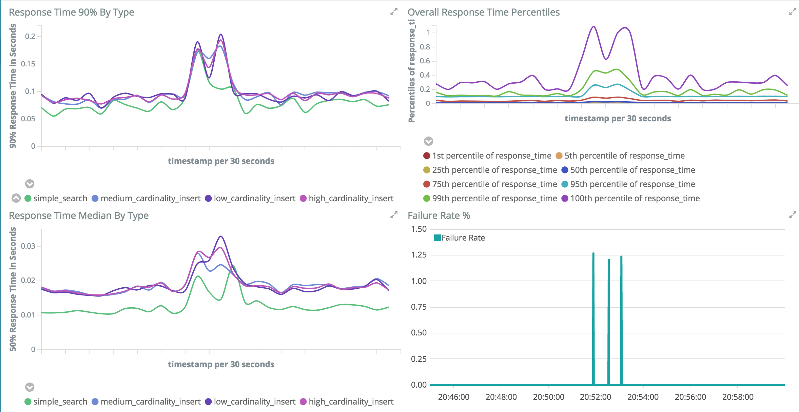
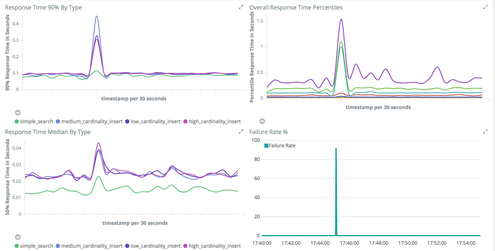

# ElasticSearch Chaos Testing on Kubernetes

This _should_ work on any Kubernetes cluster, but I've used [Kubernetes on Google Cloud](https://cloud.google.com/container-engine/docs/).

## Basic Setup

> The [Makefile](Makefile) includes all the necessary commands to launch the cluster on Google's compute cloud. It may be more up to date than what's here since that's what I use during testing.

These steps assume you are either familiar with Kubernetes and can run it yourself or you are using Google Clound Platform. If you are using GCP I'll try to include the commands needed to get it up and running.

If you do not have access to a Kubernetes cluster. [There are good docs on the Google site about how to get started with Kubernetes on GCP](https://cloud.google.com/container-engine/docs/quickstart). Here's what I used to create the GCE cluster

```bash
# This takes several minutes to run.
# Use preemptable instances for testing.
$ gcloud beta container clusters create es-test \
 --zone us-central1-c \
 --additional-zones us-central1-b \
 --num-nodes 2 --machine-type n1-highmem-2 \
 --preemptible

# If the 'kubectl get nodes' command does nothing, try this to make sure the authentication is setup
$ gcloud container clusters get-credentials es-test
```

When done testing this cluster can be shut down to avoid paying for an idle cluster with `$ gcloud container clusters delete es-test`

The imporant thing is having kubectl work and connect to your cluster. An easy example command to make sure it is working is

```bash
$ kubectl get nodes
NAME                                     STATUS    ROLES     AGE       VERSION
gke-es-test-default-pool-8e329d18-2bfr   Ready     <none>    1h        v1.7.8-gke.0
gke-es-test-default-pool-8e329d18-n1tc   Ready     <none>    1h        v1.7.8-gke.0
gke-es-test-default-pool-d8956034-6w59   Ready     <none>    1h        v1.7.8-gke.0
gke-es-test-default-pool-d8956034-pdv7   Ready     <none>    1h        v1.7.8-gke.0
```

Make sure there is enough memory available. A single node cluster with something like minikube will likely not work. This test is running on 2 n1-highmem-2 nodes with 2 CPU and 13 GB of ram each. The nodes are in different zones.

```bash
$ kubectl describe nodes | grep instance-type
    beta.kubernetes.io/instance-type=n1-highmem-2
    beta.kubernetes.io/instance-type=n1-highmem-2
    beta.kubernetes.io/instance-type=n1-highmem-2
    beta.kubernetes.io/instance-type=n1-highmem-2

$ kubectl describe nodes | grep -A3 Capacity
Capacity:
 cpu:     2
 memory:  13342000Ki
 pods:    110
--
Capacity:
 cpu:     2
 memory:  13342000Ki
 pods:    110
--
Capacity:
 cpu:     2
 memory:  13342000Ki
 pods:    110
--
Capacity:
 cpu:     2
 memory:  13342000Ki
 pods:    110
```

### Run ElasticSearch

[Helm](https://github.com/kubernetes/helm) is used here to deploy all the nodes of the ElasticSearch cluster. See their instructions for installing Helm. Once installed run `helm init` to get everything setup.

The Helm Chart configuration to run the ElasticSearch cluster is in the helm-elasticsearch folder. The values.yaml file controls the details about what gets installed and run. Take a look at the values.yaml file. This configuration will start 1 master node, 1 client node, and 2 data nodes. This is a branch from the original [ElasticSearch for Helm configuration](https://github.com/clockworksoul/helm-elasticsearch). This makes a few configuration changes and removes Curator since the alpha features it is using are not available by default in the GCE Kubernetes. Additional changes were needed to get it working with the x-pack plugin from Elastic.

To start the ElasticSearch cluster run `$ helm install helm-elasticsearch --name es-test`. These should run within a short time. Confirm everything is started with

```bash
$ kubectl get pods
NAME                                                 READY     STATUS    RESTARTS   AGE
es-test-helm-elasticsearch-client-2795351099-b50f1   2/2       Running   0          1h
es-test-helm-elasticsearch-client-2795351099-gfg8j   2/2       Running   0          1h
es-test-helm-elasticsearch-data-1264309474-631j6     2/2       Running   1          1h
es-test-helm-elasticsearch-data-1264309474-731bs     2/2       Running   1          1h
es-test-helm-elasticsearch-data-1264309474-kmbf8     2/2       Running   1          1h
es-test-helm-elasticsearch-data-1264309474-l8t4w     2/2       Running   1          1h
es-test-helm-elasticsearch-master-1015017868-02r6j   2/2       Running   0          1h
es-test-helm-elasticsearch-master-1015017868-1jt82   2/2       Running   0          1h
es-test-helm-elasticsearch-master-1015017868-1rsnv   2/2       Running   0          1h
```

With this configuration the ElasticSearch cluster is only available from inside the Kubernetes cluster. The easiest way to get access to it from outside is with port forwarding. The command `kubectl port-forward $(kubectl get pods | grep es-test-helm-elasticsearch-client | cut -f 1 -d' ' | head -n 1) 9200` will forward the local 9200 traffic to a client node.

Confirm ElasticSearch is running in your cluster and available through the local port 9200.

```bash
$ curl elastic:changeme@localhost:9200/_cat/health
1505694033 00:20:33 jpm-es-testing green 4 2 0 0 0 0 0 0 - 100.0%
```

From inside the cluster the REST API for ElasticSearch will be accessible with the service name and port 9200. Example: `curl -s elastic:changeme@es-test-helm-elasticsearch:9200/_cat/health`

### Run Kibana

Start the Elastic provided version of Kibana with `kubectl create -f kibana/kibana.yaml`. The kibana/kibana.yaml Kubernetes configuration will connect to the ElasticSearch cluster launched above. The login is the default from ElasticSearch (elastic/changeme).

To access this instance from outside the cluster a port-forward can be used. `kubectl port-forward $(kubectl get pods | grep es-test-kibana | cut -f 1 -d' ') 5601` will create a local redirect to Kibana. Open that via http://localhost:5601/.

### Run Locust

Start the basic Locust test that is included with `helm install -n locust-es-test locust`. Connect to this with `kubectl port-forward $(kubectl get pods | grep locust-es-test-master | cut -f 1 -d' ') 8089` and http://localhost:8089/.

### Run a second ElasticSearch cluster

ElasticSearch is a great tool for capturing per-request information for the chaos tests. Unfortunately these test will end up intentionally breaking the cluster. That makes it difficult and sometimes impossible to store the test results in the cluster being tested. To get around this a second very simple cluster will be used. Launch this cluster with `kubectl create -f monitoring/monitoring-es-cluster.yaml`. Forward this kibana instance to the local port 15601 with `kubectl port-forward $(kubectl get pods | grep monitoring-kibana | cut -f 1 -d' ') 15601:5601`. The performance visualizations will come from this cluster.

## Unleash the Chaos

> This assumes everything is setup as it was done above with all the ports setup to be forwarded locally. See the Makefile for the full set of commands used. Make sure http://localhost:8089/ correctly connects to [Locust](#run-locust), http://localhost:5601/ correctly connects to [Kibana](#run-kibana), http://localhost:9200/ [ElasticSearch](#run-elastic-search), and http://localhost:15601/ correct connects to the [second monitoring ElasticSearch cluster](#run-a-second-elasticsearch-cluster).

### Chaos by Hand

Generate a mixed load on the cluster with `curl localhost:8089/swarm -X POST -F locust_count=100 -F hatch_rate=10` (or use the Locust UI). In [Kibana](http://localhost:5601/app/monitoring) open the monitoring view and watch the overall cluster overview and the node view. Everything should be in a green state. Indexing rate should be around 100 RPS (Requests Per Second) for the primaries and 200 RPS total. Search rate should be around 50 RPS.

Let this run for a few minutes and then capture a snapshot of the stats from Locust (or see the UI). To get the basic stats that are shown in the UI use `curl -s http://localhost:8089/stats/requests/csv`. This should show 0 failures for any of the endpoints and median response times in the low 10s of milliseconds. A distribution of the response times is available via `curl -s http://localhost:8089/stats/distribution/csv`. 99th percentile should be around 100 ms with max at a few hundred ms.

#### Stop a Data Node

Now lets break something and see how everything responds. For the first test a single data node process will be stopped in an ungraceful manner. Before stopping the process this will reset the stats captured on the load test. After a minute this will display the post-chaos stats as seen from the load test client.

```bash
# Reset the locust stats, find the data node with the
# fewest restarts, pkill -9 the ES process
curl -s http://localhost:8089/stats/reset \
  && kubectl exec -c es-data \
    $(kubectl get pods | grep es-test-helm-elasticsearch-data \
      | sort -n -k4 | head -n1 | cut -f 1 -d' ') \
    -- pkill -9 java \
  ; sleep 60s \
  ; curl -s http://localhost:8089/stats/requests/csv ; echo "" \
  ; curl -s http://localhost:8089/stats/distribution/csv
```

The expectation from this test is a small impact to the performance of the cluster, but few or no errors. Here are the stats from Locust from just before the test starts. This shows no test failures, a median request time of 17 msec, and a max request time of 214 msec.

```bash
# Pre-chaos stats
"Method","Name","# requests","# failures","Median response time","Average response time","Min response time","Max response time","Average Content Size","Requests/s"
"PUT","high_cardinality_insert",4485,0,17,32,8,203,171,75.61
"PUT","low_cardinality_insert",436,0,16,33,7,214,169,7.35
"PUT","medium_cardinality_insert",448,0,17,34,8,205,172,7.55
"GET","simple_search",428,0,10,22,5,113,2596,7.21
"None","Total",5797,0,17,31,5,214,350,97.72

"Name","# requests","50%","66%","75%","80%","90%","95%","98%","99%","100%"
"PUT high_cardinality_insert",4502,17,23,37,53,87,100,110,110,203
"PUT low_cardinality_insert",437,17,22,41,53,93,100,110,190,214
"PUT medium_cardinality_insert",452,17,24,52,69,94,99,110,130,205
"GET simple_search",429,10,15,23,31,67,90,100,100,113
"None Total",5820,17,22,37,53,87,99,110,120,214
```

Here are the stats starting just before the chaos starts and collecting for about a minute. This shows a small increase in the latency at the 50th percentile. At higher percentiles the response time goes up a lot more. The max response time is almost 4 times higher than before the chaos.

```bash
# During chaos stats
"Method","Name","# requests","# failures","Median response time","Average response time","Min response time","Max response time","Average Content Size","Requests/s"
"PUT","high_cardinality_insert",4179,1,24,60,6,820,172,70.09
"PUT","low_cardinality_insert",431,0,22,58,7,552,169,7.23
"PUT","medium_cardinality_insert",421,0,22,62,8,644,172,7.06
"GET","simple_search",439,0,16,52,4,589,2546,7.36
"None","Total",5470,1,23,60,4,820,362,91.74

"Name","# requests","50%","66%","75%","80%","90%","95%","98%","99%","100%"
"PUT high_cardinality_insert",4179,24,53,80,94,140,230,340,430,820
"PUT low_cardinality_insert",431,22,42,70,85,160,250,330,420,552
"PUT medium_cardinality_insert",421,22,52,86,98,160,230,310,440,644
"GET simple_search",439,16,31,59,81,140,240,360,440,589
"None Total",5470,23,50,79,94,140,230,340,430,820
```

The stats coming from Locust don't have enough detail to see what's happening here. This is where the [second monitoring ElasticSearch cluster](#run-a-second-elasticsearch-cluster) can help. The request level data captured in this cluster provides better visibility into the failure and response time impact on the cluster. The impact to the cluster lasts about 90 seconds. This lines up with the [default Zen Discovery Fault Detection settings](https://www.elastic.co/guide/en/elasticsearch/reference/5.6/modules-discovery-zen.html#fault-detection). Once the down data node is detected, the cluster goes into a yellow state and the now unavailable shards are replicated. Because there is not much data in this cluster the replication finishes quickly and the cluster returns to a green state.



#### Stop the Active Master Node

Next lets stop the active master node

```bash
curl -s http://localhost:8089/stats/reset \
  && kubectl exec \
    $(curl -s elastic:changeme@localhost:9200/_cat/master | awk '{print $4}') \
    -- pkill -9 java \
  ; sleep 60s \
  ; curl -s http://localhost:8089/stats/requests/csv ; echo "" \
  ; curl -s http://localhost:8089/stats/distribution/csv
```

```bash
# Pre-chaos stats
"Method","Name","# requests","# failures","Median response time","Average response time","Min response time","Max response time","Average Content Size","Requests/s"
"PUT","high_cardinality_insert",4386,0,22,38,8,394,171,73.39
"PUT","low_cardinality_insert",427,0,22,38,9,290,167,7.14
"PUT","medium_cardinality_insert",441,0,22,35,9,260,171,7.38
"GET","simple_search",429,0,11,23,5,205,2116,7.18
"None","Total",5683,0,21,37,5,394,318,95.09

"Name","# requests","50%","66%","75%","80%","90%","95%","98%","99%","100%"
"PUT high_cardinality_insert",4403,22,32,52,67,97,100,120,190,394
"PUT low_cardinality_insert",431,22,36,54,66,98,110,120,200,290
"PUT medium_cardinality_insert",445,22,30,44,58,87,98,110,120,260
"GET simple_search",430,11,17,23,32,73,94,100,120,205
"None Total",5709,21,30,49,63,95,100,120,180,394
```


```bash
# During chaos stats
"Method","Name","# requests","# failures","Median response time","Average response time","Min response time","Max response time","Average Content Size","Requests/s"
"PUT","high_cardinality_insert",4045,98,29,62,8,1275,171,67.41
"PUT","low_cardinality_insert",406,11,30,62,10,1416,167,6.77
"PUT","medium_cardinality_insert",418,14,28,57,9,803,171,6.97
"GET","simple_search",393,0,16,41,5,611,2205,6.55
"None","Total",5262,123,28,60,5,1416,323,87.69

"Name","# requests","50%","66%","75%","80%","90%","95%","98%","99%","100%"
"PUT high_cardinality_insert",4061,29,48,71,87,110,200,340,630,1275
"PUT low_cardinality_insert",406,31,47,63,81,110,150,360,740,1416
"PUT medium_cardinality_insert",423,28,44,65,81,110,180,300,660,803
"GET simple_search",395,16,26,39,59,96,120,240,500,611
"None Total",5285,28,45,68,84,110,190,340,620,1416
```


